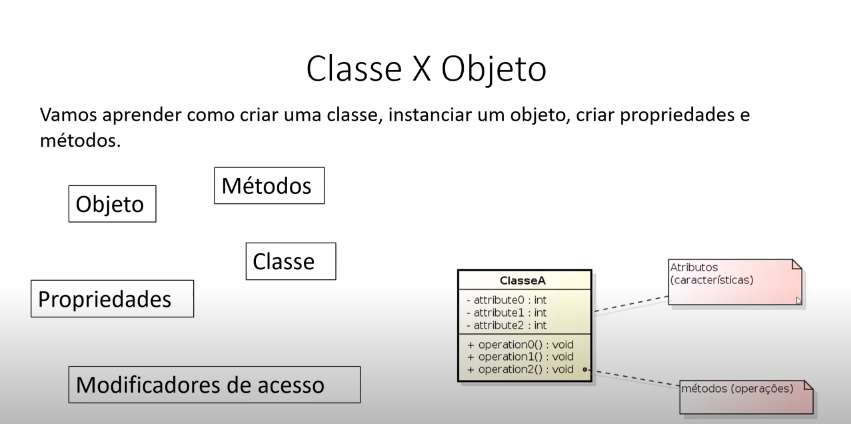

✔ [           C# POO - 01 O que é programação orientada a objetos         ](https://www.youtube.com/watch?v=qWDrDOyiLe8&list=PLfvOpw8k80Wreysmw8fonLCBw8kiiYjIU&index=1&t=29s) 

>
>
>
>
>
>
>
>
>

✔ [           C# POO - 02 Minha Primeira Classe         ](https://www.youtube.com/watch?v=qxkus6YJP0g&list=PLfvOpw8k80Wreysmw8fonLCBw8kiiYjIU&index=4)

>  
>
> > Exemplo:
> >
> > ```c#
> > Program.cs 
> > static void Main(string[] args)
> >     {
> >         //ENTRADAS
> >         Mensagem msg1, msg2;
> > 
> >         //PROCESSAMENTO
> >         msg1 = new Mensagem();//objeto1
> >         msg1.TextoMensagem = "Olá, seja bem vindo!\n";//instância
> >         msg1.ExibirMensagem();//ação do objeto1
> > 
> >         msg2 = new Mensagem();//objeto2
> >         msg2.TextoMensagem = "Segundo objeto";//instância
> >         msg2.ExibirMensagem();//ação do objeto2
> > 
> >         //SAIDA
> >         Console.ReadKey();
> >     }
> > 
> > Classe
> > namespace PooMensagem
> > {//< public > deixando objeto publico para ser usado em outra instância
> >     public class Mensagem
> >     {
> > 
> >        public String TextoMensagem;
> >         
> >        public void ExibirMensagem()//método exibir mensagem
> >         {
> >             Console.WriteLine(this.TextoMensagem);//this enterage com objeto
> >         }
> > 
> >     }
> > 
> > ```


[           C# POO - 03 Encapsulamento e métodos de acesso         ](https://www.youtube.com/watch?v=KhlJXXq90EA&list=PLfvOpw8k80Wreysmw8fonLCBw8kiiYjIU&index=5)


[           C# POO - 04 Propriedades no C# (Sharp)         ](https://www.youtube.com/watch?v=SKgOuvkjFOc&list=PLfvOpw8k80Wreysmw8fonLCBw8kiiYjIU&index=6)

[           C# POO - 05 Exercício Cálculo da Idade         ](https://www.youtube.com/watch?v=0DLZ6V0QMNg&list=PLfvOpw8k80Wreysmw8fonLCBw8kiiYjIU&index=7)

[           C# POO - 06 Um pouco mais sobre propriedades         ](https://www.youtube.com/watch?v=cNs92nnLvog&list=PLfvOpw8k80Wreysmw8fonLCBw8kiiYjIU&index=8)

[           C# POO - 06.1  Exercício animal de estimação         ](https://www.youtube.com/watch?v=nfxTLUhzICM&list=PLfvOpw8k80Wreysmw8fonLCBw8kiiYjIU&index=9)

[           C# POO - Estudo de caso ( Jogo de andar e pular em modo console )         ](https://www.youtube.com/watch?v=FIBtrPn6uRk&list=PLfvOpw8k80Wreysmw8fonLCBw8kiiYjIU&index=10)

[           C# POO - 07 Construtores         ](https://www.youtube.com/watch?v=TXKkntEvTyc&list=PLfvOpw8k80Wreysmw8fonLCBw8kiiYjIU&index=11)

[           C# POO - 7 2 Exercício cálculo da área de um retângulo utilizando classes/objetos         ](https://www.youtube.com/watch?v=4EVq2HUO3TI&list=PLfvOpw8k80Wreysmw8fonLCBw8kiiYjIU&index=13)

[           C# POO # Projeto A Hora do Pitch modo Console - Apresentação do projeto         ](https://www.youtube.com/watch?v=kyFK0emDKJw&list=PLfvOpw8k80Wreysmw8fonLCBw8kiiYjIU&index=14)

[           C# POO # Projeto A Hora do Pitch modo Console - 03 Melhorando a classe Alarme         ](https://www.youtube.com/watch?v=10gB6hlQDKo&list=PLfvOpw8k80Wreysmw8fonLCBw8kiiYjIU&index=17)

[           C# POO - 08 Construindo uma Pokédex         ](https://www.youtube.com/watch?v=6hppinQ_frg&list=PLfvOpw8k80Wreysmw8fonLCBw8kiiYjIU&index=18)

[           C# POO - 09 Sobrecarga de membros/métodos         ](https://www.youtube.com/watch?v=l2m5bTVOpfI&list=PLfvOpw8k80Wreysmw8fonLCBw8kiiYjIU&index=19)

[           C# POO - 10 Utilizando objetos como propriedades (Pokédex)         ](https://www.youtube.com/watch?v=YFUzhpP9hB8&list=PLfvOpw8k80Wreysmw8fonLCBw8kiiYjIU&index=20)

[           C# POO - 11 Listando os Pokémons         ](https://www.youtube.com/watch?v=FjR7s5178g0&list=PLfvOpw8k80Wreysmw8fonLCBw8kiiYjIU&index=21)

[           C# POO - 12.2 Exercício controle de animais utlizando array         ](https://www.youtube.com/watch?v=j11crWf-H7I&list=PLfvOpw8k80Wreysmw8fonLCBw8kiiYjIU&index=23)

[           C# POO - 12.3 Exercício controle de animais utlizando array         ](https://www.youtube.com/watch?v=r88z8uiHuQg&list=PLfvOpw8k80Wreysmw8fonLCBw8kiiYjIU&index=24)

[           C# POO - 13 herança         ](https://www.youtube.com/watch?v=x2SDmXhcGO0&list=PLfvOpw8k80Wreysmw8fonLCBw8kiiYjIU&index=25)

[           C# POO - 14 Jogo de combate pokémon         ](https://www.youtube.com/watch?v=fJQ5LkuyJGs&list=PLfvOpw8k80Wreysmw8fonLCBw8kiiYjIU&index=26)

[           C# POO - 15 Jogo de combate pokémon         ](https://www.youtube.com/watch?v=xz02aocGatc&list=PLfvOpw8k80Wreysmw8fonLCBw8kiiYjIU&index=27)

[           C# POO - 16 Melhorando o Jogo de combate pokémon         ](https://www.youtube.com/watch?v=BJxpUu3E55Y&list=PLfvOpw8k80Wreysmw8fonLCBw8kiiYjIU&index=28)

[           C# POO - 16.1 Exercício Jogo da adivinhação         ](https://www.youtube.com/watch?v=gPcMOOxN_Ds&list=PLfvOpw8k80Wreysmw8fonLCBw8kiiYjIU&index=29)

[           C# POO - 16.2 Exercício Gerenciando meu zoológico         ](https://www.youtube.com/watch?v=bi0BrJecSxk&list=PLfvOpw8k80Wreysmw8fonLCBw8kiiYjIU&index=30)

[           C# POO - 16.3 Erros mais comuns - Programação orientado a objetos         ](https://www.youtube.com/watch?v=Wkwz2Dz3XXQ&list=PLfvOpw8k80Wreysmw8fonLCBw8kiiYjIU&index=31)

[           C# POO - 16.4 Exercício Jogo da adivinhação - (Gerenciador do jogo)         ](https://www.youtube.com/watch?v=a4Beh5IBryg&list=PLfvOpw8k80Wreysmw8fonLCBw8kiiYjIU&index=32)

[           C# POO - 17 Destruidores         ](https://www.youtube.com/watch?v=hm15kTZktGs&list=PLfvOpw8k80Wreysmw8fonLCBw8kiiYjIU&index=33)

[           C# POO - 18 Static (Minha própria classe Console)         ](https://www.youtube.com/watch?v=H1TpgankGqo&list=PLfvOpw8k80Wreysmw8fonLCBw8kiiYjIU&index=34)

[           C# POO - 19 Static (Utilizando recursos static em objetos)         ](https://www.youtube.com/watch?v=xTbsc7iISzg&list=PLfvOpw8k80Wreysmw8fonLCBw8kiiYjIU&index=35)

[           C# POO - 20 Polimorfismo         ](https://www.youtube.com/watch?v=bIqxNMAPkHU&list=PLfvOpw8k80Wreysmw8fonLCBw8kiiYjIU&index=36)

[           C# POO - 21 Polimorfismo virtual propriedades         ](https://www.youtube.com/watch?v=kGxYlhcPsHs&list=PLfvOpw8k80Wreysmw8fonLCBw8kiiYjIU&index=37)

[           C# POO - 22 Polimorfismo recursos interessantes         ](https://www.youtube.com/watch?v=PFI5PGlNnmU&list=PLfvOpw8k80Wreysmw8fonLCBw8kiiYjIU&index=38)

[           C# POO - 23 Exercício Polimorfismo - Conta estudante         ](https://www.youtube.com/watch?v=TJIEmSCQer0&list=PLfvOpw8k80Wreysmw8fonLCBw8kiiYjIU&index=39)

[           C# POO - 24 Classe abstrata         ](https://www.youtube.com/watch?v=4dBX7exYx4Y&list=PLfvOpw8k80Wreysmw8fonLCBw8kiiYjIU&index=40)

[           C# POO - 25 Classe abstrata         ](https://www.youtube.com/watch?v=qTF0Fw4tSYs&list=PLfvOpw8k80Wreysmw8fonLCBw8kiiYjIU&index=41)

[           C# POO - 26 Interface         ](https://www.youtube.com/watch?v=P9xCQ1kBFGI&list=PLfvOpw8k80Wreysmw8fonLCBw8kiiYjIU&index=42)

[           C# POO - 12.1 Tipo de dados enum         ](https://www.youtube.com/watch?v=7H-tXH0TJWQ&list=PLfvOpw8k80Wreysmw8fonLCBw8kiiYjIU&index=43)

[           C# POO - 27 Classe de gerenciamento de matérias         ](https://www.youtube.com/watch?v=pV5bUD0p_xg&list=PLfvOpw8k80Wreysmw8fonLCBw8kiiYjIU&index=44)

[           C# POO - 28 Classe de gerenciamento de materias         ](https://www.youtube.com/watch?v=27YY7PAwQ3Y&list=PLfvOpw8k80Wreysmw8fonLCBw8kiiYjIU&index=45)

[           C# POO - 29 Classe de gerenciamento de matérias         ](https://www.youtube.com/watch?v=1-UAaMJTbII&list=PLfvOpw8k80Wreysmw8fonLCBw8kiiYjIU&index=46)

[           C# POO - 31 Como trabalhar com List - Apresentação         ](https://www.youtube.com/watch?v=WTPNuD-ddEs&list=PLfvOpw8k80Wreysmw8fonLCBw8kiiYjIU&index=47)

[           C# POO - 31 Como trabalhar com List - Criando a Classe Jogo         ](https://www.youtube.com/watch?v=VaUMv5kQgoI&list=PLfvOpw8k80Wreysmw8fonLCBw8kiiYjIU&index=48)

[           C# POO - 32 Como trabalhar com List - Criando a classe Lista de jogos e o método Inserir         ](https://www.youtube.com/watch?v=QuXonE_C6YU&list=PLfvOpw8k80Wreysmw8fonLCBw8kiiYjIU&index=49)

[           C# POO - 33 Como trabalhar com List - Classe Lista de jogos (Remover   Localizar e Excluir)         ](https://www.youtube.com/watch?v=10z0c-PkhCQ&list=PLfvOpw8k80Wreysmw8fonLCBw8kiiYjIU&index=50)

[           C# POO - 34 Como trabalhar com List - Implementando o programa principal ( Listar jogos )         ](https://www.youtube.com/watch?v=91-D76C6VQM&list=PLfvOpw8k80Wreysmw8fonLCBw8kiiYjIU&index=51)

[           C# POO - 35 Como trabalhar com List - Implementando o programa principal         ](https://www.youtube.com/watch?v=OWXfRv1A08s&list=PLfvOpw8k80Wreysmw8fonLCBw8kiiYjIU&index=52)

[           C# POO - 36 Como trabalhar com List - Implementando o programa principal         ](https://www.youtube.com/watch?v=KeYNvbeBTAg&list=PLfvOpw8k80Wreysmw8fonLCBw8kiiYjIU&index=53)

[           C# POO - 37 Trabalhando com Interfaces e Listas (Cadastro de Obras)         ](https://www.youtube.com/watch?v=TzCc3FjqycQ&list=PLfvOpw8k80Wreysmw8fonLCBw8kiiYjIU&index=54)

[           C# POO - Corrida Maluca # 01 Apresentação  (Como criar um jogo em modo console)         ](https://www.youtube.com/watch?v=TaNbXYMgXSM&list=PLfvOpw8k80Wreysmw8fonLCBw8kiiYjIU&index=55)

[           🔴 LIVE |  Construindo um jogo de corrida em modo console utilizando C#         ](https://www.youtube.com/watch?v=gBvy9GFMbRU&list=PLfvOpw8k80Wreysmw8fonLCBw8kiiYjIU&index=56)

[           C# POO - Corrida Maluca  # 02 Criando o programa principal  (Como criar um jogo em modo console)         ](https://www.youtube.com/watch?v=cI4Lol3V8cs&list=PLfvOpw8k80Wreysmw8fonLCBw8kiiYjIU&index=57)

[           C# POO - Corrida Maluca # 03 Melhorando o jogo (Como criar um jogo em modo console)         ](https://www.youtube.com/watch?v=_12nn7Sunnk&list=PLfvOpw8k80Wreysmw8fonLCBw8kiiYjIU&index=58)


